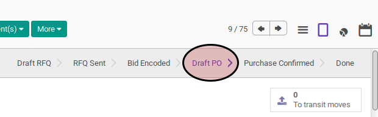

# Convert To PO

## A. INPUT

* Data purchase order yang akan di-*convert* harus memiliki status **Draft Rfq**

* User yang akan melakukan *convert to PO* harus memiliki akses untuk *convert to PO*

## B. LANGKAH KERJA

1. Buka menu **Purchase -> Purchase -> Requests for Quotation**. Abaikan berada pada menu yang dimaksud
2. Bukan data purchase order yang akan diconvert. Abaikan jika data sudah dibuka.
3. Klik tombol **Convert To Po** pada bagian atas-kiri form.

## C. OUTPUT

* Status purchase order akan berubah menjadi **Draft PO**

