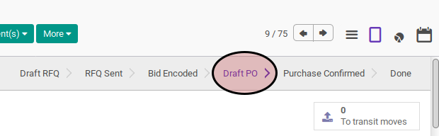
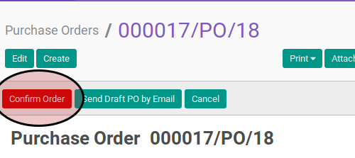
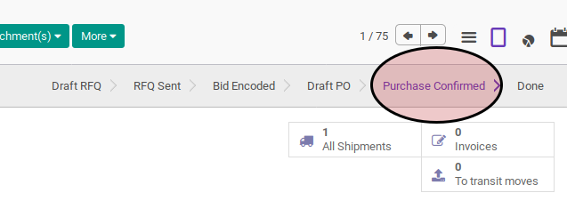

# Mengkonfirmasi Purchase Order

## A. INPUT

* Data purchase order yang akan dikonfirmasi harus memiliki status **Draft PO**

* User yang akan melakukan konfirmasi harus memiliki akses untuk mengkonfirmasi purchase order

## B. LANGKAH KERJA

1. Buka menu **Purchase -> Purchase -> Requests for Quotation**. Abaikan berada pada menu yang dimaksud
2. Bukan data purchase order yang akan diconvert. Abaikan jika data sudah dibuka.
3. Klik tombol **Confirm Order** pada bagian atas-kiri form.

## C. OUTPUT

* Status purchase order akan berubah menjadi **Purchase Confirm**

