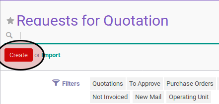
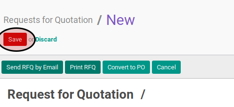
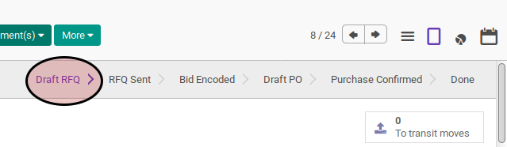

# Membuat Purchase Order

## A. INPUT

## B. LANGKAH KERJA

1. Buka menu **Purchase -> Purchase -> Requests for Quotation**.
2. Klik tombol **Create** pada bagian atas-kiri form.

3. Isi data sesuai dengan [Petunjuk Pengisian Purchase Order](./petunjuk-pengisian.md).
4. <a name="l4">Klik</a> tombol **Save** pada bagian atas-kiri form.

## C. OUTPUT

* Data purchase order akan terbuat dengan status **Draft RFQ**

