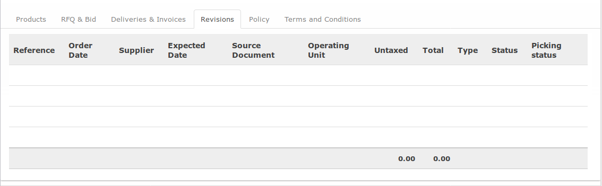

# Penjelasan Purchase Order

* [Header](#header)
* [Tab Products](#tab-product)
* [Tab RFQ & Bids](#tab-rfq)
* [Tab Revisions](#tab-revision)
* [Tab Policy](#tab-policy)
* [Tab Terms and Conditions](#tab-term)

## <a name="header">A. HEADER</a>

## <a name="tab-product">B. TAB PRODUCTS</a>

## <a name="tab-rfq">C. TAB RFQ & BID</a>

## <a name="tab-revision">D. TAB REVISIONS</a>

## <a name="tab-policy">E. TAB POLICY</a>

## <a name="tab-term">F. TAB TERMS AND CONDITIONS</a>

