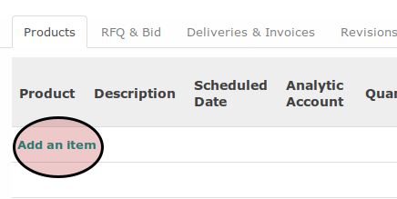

# Petunjuk Pengisian Purchase Order Line

## A. INPUT

## B. LANGKAH KERJA

1. <a name="l1">Klik</a> label **Add an Item** pada tabel **Products**

2. Pilih **Product**. Harus diisi.
3. Sesuaikan isian **Description** jika dibutuhkan. Harus diisi.
4. Isi **Schedule Date**. Harus diisi.
5. Pilih **Analytic Account**. Tidak harus diisi.
6. Isi **Quantity**. Harus diisi.
7. Sesuaikan pilihan **Product Unit of Measure** jika dibutuhkan. Harus diisi.
8. Isi **Unit Price**. Harus diisi.
9. Pilih **Taxes**. Tidak harus diisi.
10. Ulangi [langkah ke-1](#l1) untuk menambahkan produk berikutnya.
11. Lanjutkan ke [langkah ke-13 Petunjuk Pengisian Purchase Order](./petunjuk-pengisian.md#l13)
